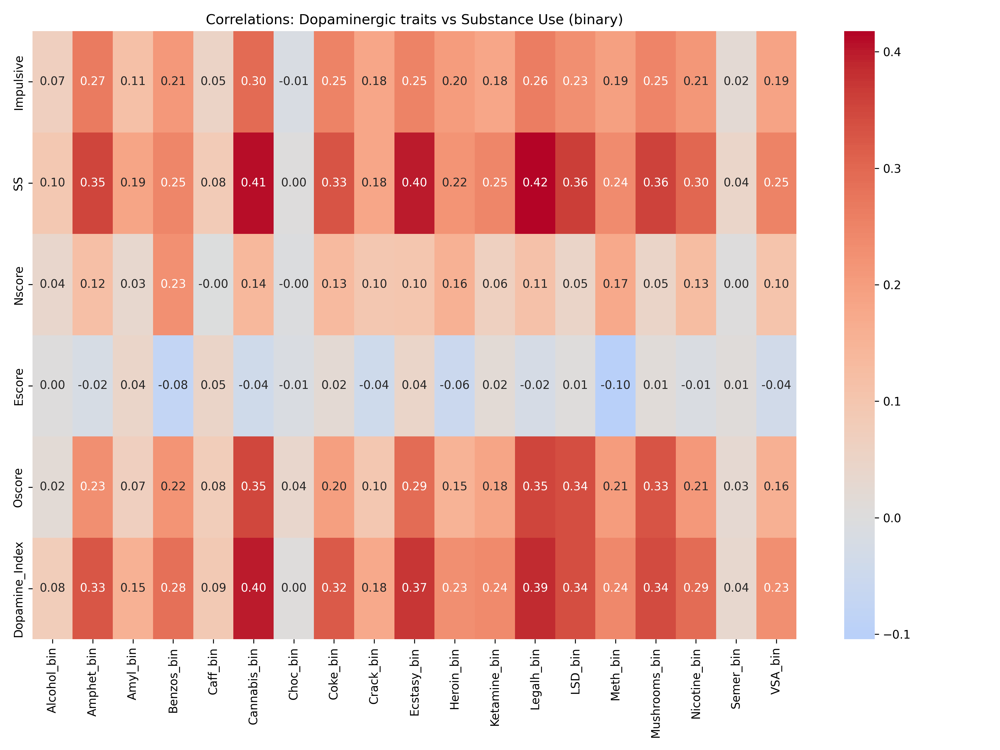
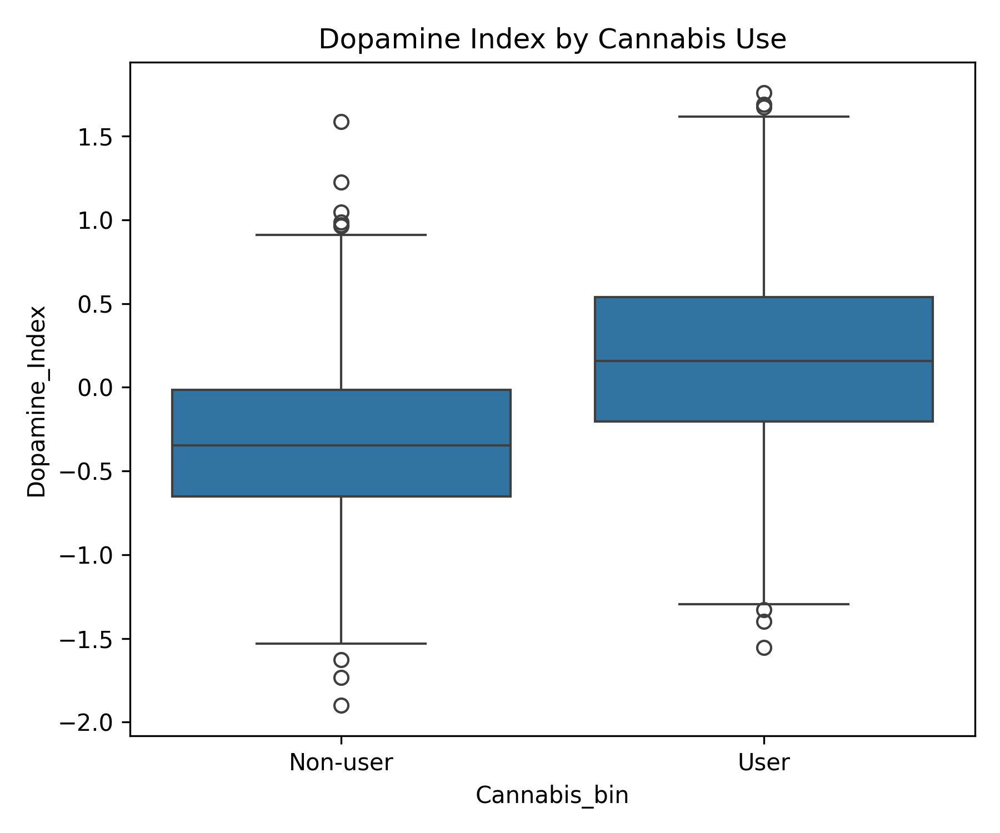
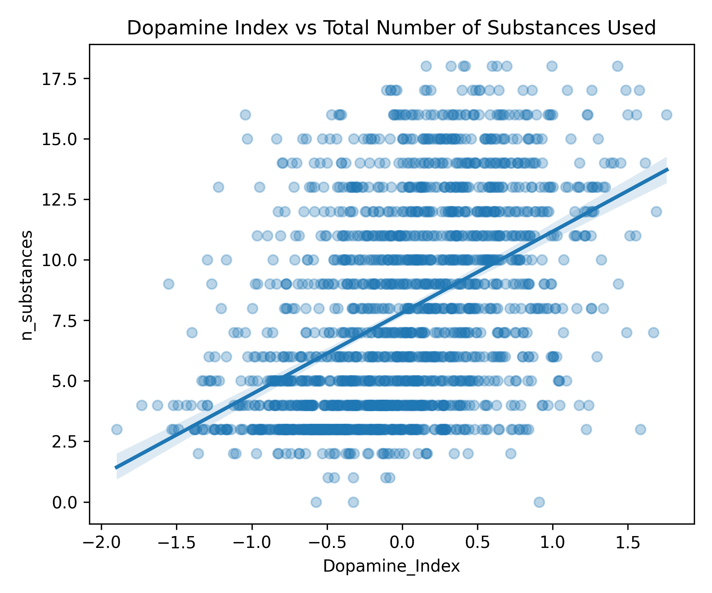
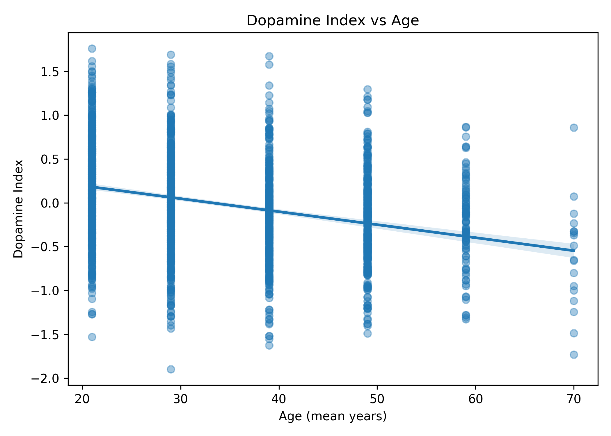
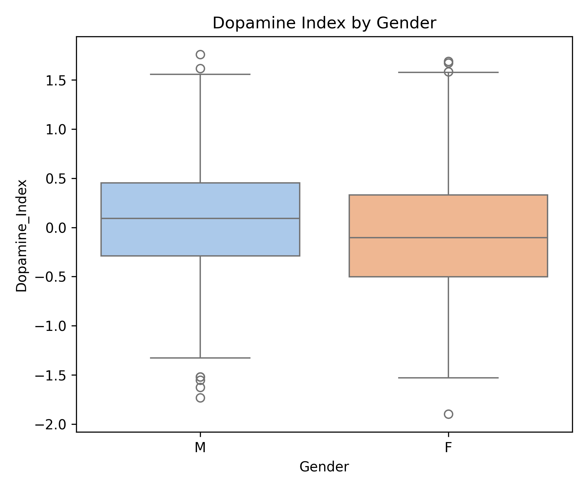
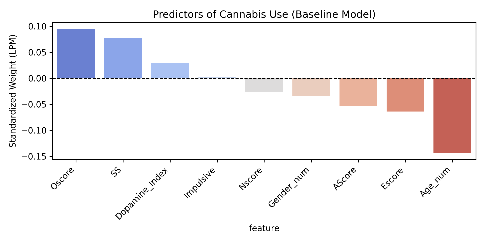

# Neurobiological Correlates of Dopaminergic Trait Expression and Substance Use  
### A Multi-Substance Exploratory and Predictive Neuro-Data Analysis

---

## Abstract

The dopaminergic system plays a central role in reward processing, motivation, and addiction vulnerability. This project investigates the relationship between dopaminergic personality traits and substance use behaviours across 19 substances using the *Drug Consumption (Quantified)* dataset. A Dopamine Index was constructed from standardized trait measures (Impulsivity, Sensation Seeking, Neuroticism, Extraversion, and Openness) to estimate individual dopaminergic reactivity. Exploratory, demographic, and predictive analyses were conducted, including a baseline model of cannabis use and a cross-substance dopaminergic comparison. Results indicate that individuals with higher dopaminergic trait expression demonstrate greater substance experimentation and higher likelihood of cannabis use, with cocaine showing an even stronger dopaminergic association. These findings are interpreted in light of three theoretical frameworks: Incentive Sensitization Theory, Reward Deficiency Syndrome, and Dual-System Models of impulsivity and cognitive control.

---

## Table of Contents

1. Introduction  
2. Why This Project Matters  
3. Scientific Background  
   3.1. Incentive Sensitization Theory  
   3.2. Reward Deficiency Syndrome  
   3.3. Dual-System Model  
4. Research Question and Hypotheses  
5. Dataset and Variables  
6. Methods  
7. Results  
   7.1. Exploratory Findings  
   7.2. Demographic Influences  
   7.3. Predictive Model: Cannabis  
   7.4. Cross-Substance Comparison  
8. Discussion  
9. Relevance for AI and Neurotechnology Careers  
10. Limitations  
11. Future Directions  
12. Glossary  
13. References  

---

## 1. Introduction

Dopamine is critically involved in reward processing, reinforcement learning, and the attribution of motivational value to stimuli. Interindividual differences in dopaminergic functioning have been associated with behavioural traits such as impulsivity, sensation seeking, and reward sensitivity — all of which contribute to vulnerability to substance use and addiction. Understanding how dopaminergic personality traits relate to drug-taking behaviours can inform early prevention, risk profiling, and neuropsychological models of addiction.

This project aims to quantify dopaminergic trait expression and examine its relationship with substance use patterns in a non-clinical population sample. Both exploratory and predictive approaches were applied to assess whether individuals exhibiting dopaminergic behavioural phenotypes are more prone to experimenting with, or regularly using, psychoactive substances.

---

## 2. Why This Project Matters

Addiction research increasingly requires approaches that integrate behavioural neuroscience with quantitative modelling. While neuroimaging has provided meaningful insights into dopaminergic functioning, scalable and non-invasive behavioural markers remain essential for early risk identification.

This project is relevant because:

- It combines neuroscientific theory with data-driven methodology to examine addiction vulnerability through a dopaminergic lens.  
- It uses a behavioural proxy (Dopamine Index) that can be applied at scale for early-stage screening, unlike neuroimaging approaches.  
- It includes a multi-substance comparison, highlighting both behavioural and pharmacological differences in dopaminergic involvement.  
- It contributes to the growing fields of computational psychiatry and neuroscience-informed data analysis.  
- It provides a framework that can support prevention-focused mental health strategies and early identification of at-risk individuals.

---

## 3. Scientific Background

Addiction has been consistently linked to dysregulation of dopaminergic circuits, particularly those connecting the **ventral tegmental area (VTA)**, **nucleus accumbens (NAcc)**, and the **prefrontal cortex (PFC)**. Three major theories provide a conceptual framework for understanding dopamine’s role in addictive processes.

### 3.1 Incentive Sensitization Theory (Robinson & Berridge)

This theory proposes that repeated drug exposure sensitizes mesolimbic dopamine pathways, heightening *“wanting”* (the motivational drive to seek the drug) even when *“liking”* (subjective pleasure) declines. Dopamine is therefore primarily implicated in incentive salience attribution rather than hedonic pleasure. Individuals with higher dopaminergic reactivity may be more susceptible to sensitization, resulting in strengthened drug-seeking behaviours over time.

### 3.2 Reward Deficiency Syndrome (Blum et al.)

Reward Deficiency Syndrome suggests that some individuals possess chronically reduced dopaminergic activity or receptor availability, leading to diminished reward from natural stimuli. Such individuals may engage in external dopamine-enhancing behaviours, including substance use, as compensatory stimulation. Impulsivity and sensation seeking are considered behavioural markers of this vulnerability, reflecting attempts to overcome an underlying reward deficit.

### 3.3 Dual-System Model: Impulsivity vs Cognitive Control

This model describes an imbalance between fast, impulsive, reward-driven systems (striatum, dopamine) and slower, reflective, executive control systems (prefrontal cortex). Adolescents and young adults are particularly sensitive to dopaminergic reward cues due to delayed maturation of prefrontal regulation. This framework explains why younger individuals and those high in impulsivity are at greater risk of engaging in substance use, especially for drugs that heavily influence the reward system.

---

### Dopaminergic Reward Circuit (Conceptual Diagram)

The following diagram illustrates the key structures involved in dopaminergic reward signalling, including pathways relevant to cannabis and cocaine:

  

*Figure X. Conceptual overview of the mesolimbic dopaminergic reward pathway (VTA → NAcc → PFC), including modulation by cannabis and cocaine.*

---

## 4. Research Question and Hypotheses

### Research Question

To what extent do dopaminergic personality traits predict substance use behaviours and addiction vulnerability across different drugs?

### Hypotheses

**H1** — Individuals with higher dopaminergic trait expression (Dopamine Index) will show increased likelihood of substance use and experimentation across multiple drugs.  

**H2** — Dopaminergic traits will significantly predict cannabis use due to its dopaminergic and endocannabinoid effects within the mesolimbic pathway.  

**H3** — Cocaine will show a stronger dopaminergic association than cannabis, due to its direct reinforcement of synaptic dopamine via reuptake inhibition.  

**H4** — Age will negatively correlate with dopaminergic expression and substance use, reflecting maturation of cognitive control and natural decline of dopaminergic tone across adulthood.  

---

## 5. Dataset and Variables

### Dataset

**Source:** UCI Machine Learning Repository – Drug Consumption (Quantified)  
**Sample Size:** 1,884 participants  
**Variables:** 32 total variables

The dataset includes demographic information, personality traits, impulsivity and sensation seeking scores, as well as self-reported lifetime consumption of 19 substances.

### Key Variables

| Category | Variables | Description |
|----------|------------|-----------------------------|
| Demographics | Age, Gender | Age groups and biological sex |
| Personality (Big Five) | Nscore, Escore, Oscore, AScore, Cscore | Standardized Big Five traits |
| Dopaminergic Traits | Impulsive, SS, Nscore, Escore, Oscore | Used to compute the Dopamine Index |
| Substance Use | 19 substances | Recoded into binary (user vs non-user) |

### Dopamine Index (Engineered Variable)

A composite **Dopamine Index** was constructed using z-scored values of:

- Impulsivity  
- Sensation Seeking (SS)  
- Neuroticism (Nscore)  
- Extraversion (Escore)  
- Openness (Oscore)  

This index represents a behavioural proxy of dopaminergic sensitivity aligned with prior research linking these traits to reward-seeking tendencies and dopaminergic functioning.

---

## 6. Methods

Analyses were conducted using Python (`pandas`, `numpy`, `matplotlib`, `seaborn`).  
To ensure transparent modelling, the predictive model was implemented without machine learning libraries.

### Methodological Steps

1. **Data Preprocessing**  
   - Standardization of dopaminergic trait scores  
   - Binarization of substance use frequencies  
   - Mapping of age and gender to numeric values  

2. **Exploratory Analysis**  
   - Correlation heatmaps to examine dopaminergic traits vs substance use  
   - Visualizations of cannabis use and number of substances consumed  

3. **Demographic Analysis**  
   - Examination of dopaminergic expression across age and gender  

4. **Predictive Modelling**  
   - Baseline Linear Probability Model (LPM) predicting cannabis use  
   - Additional dopaminergic comparison across five substances  

---

## 7. Results

### 7.1 Exploratory Findings

#### Dopaminergic Traits and Substance Use

Strong positive associations emerged between the Dopamine Index, Impulsivity, Sensation Seeking, and use of several psychoactive substances, particularly cannabis, LSD, cocaine, and alcohol.

**Interpretation:**  
Individuals with stronger dopaminergic expression tend to experiment with a wider range of substances. This supports models linking dopamine to reward sensitivity and novelty-seeking behaviours.

---

#### Dopamine Index and Cannabis Use

Cannabis users display higher Dopamine Index values compared to non-users.

**Interpretation:**  
Cannabis use appears associated with dopaminergic behavioural profiles. This is consistent with cannabis-induced CB1 receptor activation modulating dopamine in the mesolimbic pathway.

---

#### Dopaminergic Trait Expression and Number of Substances Used

A positive relationship was observed between the Dopamine Index and the number of substances tried.

**Interpretation:**  
Higher dopaminergic phenotypes predict a broader range of substance experimentation, aligning with incentive salience theory, whereby individuals seek rewarding and novel stimuli.

---

### 7.2 Demographic Influences

#### Age

A negative correlation was found between age and the Dopamine Index.

**Interpretation:**  
Dopaminergic expression decreases with age, consistent with known reductions in dopamine receptor availability and enhanced prefrontal control across adulthood.

#### Gender

Males showed slightly higher Dopamine Index values than females, though variability was high.

**Interpretation:**  
Gender differences are present but modest, suggesting that dopaminergic traits are not sex-specific determinants of substance use vulnerability.

---

### 7.3 Predictive Model: Cannabis

**Top Predictors of Cannabis Use**

| Variable | Interpretation |
|----------|----------------|
| Dopamine Index | Higher dopaminergic traits increase likelihood of cannabis use |
| Impulsivity | Lower inhibitory control increases reward-seeking |
| Sensation Seeking | Preference for novelty and stimulation drives experimentation |

Age showed a negative effect, confirming younger individuals are more vulnerable.

**Model Summary:**  
Dopaminergic traits are robust predictors of cannabis use, supporting a behavioural vulnerability model.

---

## 8. Why Cannabis?

Cannabis was selected as the primary target substance due to:

1. **Neurobiological Relevance**  
   Cannabis modulates dopamine via CB1 receptor activation within mesolimbic circuits, linking it to reward and motivation.

2. **Balanced Addictive Profile**  
   Cannabis shows motivational reinforcement without the immediate dopaminergic surge seen in cocaine or amphetamines, making it suitable for studying vulnerability rather than dependence.

3. **High Prevalence in Dataset**  
   Cannabis use was common enough to provide statistical power for modelling.

---

### 7.4 Cross-Substance Comparison

A multi-substance comparison showed that while cannabis has a strong dopaminergic association, cocaine ranked even higher.

| Substance | Dopaminergic Coefficient | Interpretation |
|-----------|---------------------------|----------------|
| Cocaine | Highest | Direct dopamine reuptake blockade produces strong reinforcement |
| Cannabis | High | Indirect modulation of dopamine via endocannabinoid pathways |
| LSD | Moderate | Dopaminergic involvement combined with serotonergic mechanisms |

**Interpretation:**  
Cannabis reflects behavioural dopaminergic vulnerability, while cocaine reflects direct neurochemical reinforcement.

---

## 9. Discussion

These findings align with major addiction theories:

- **Incentive Sensitization Theory:** Individuals with stronger dopaminergic traits may attribute higher incentive salience to drugs, increasing compulsive drug-seeking.  
- **Reward Deficiency Syndrome:** Lower baseline dopaminergic activity may lead individuals to seek external stimulation through substances.  
- **Dual-System Model:** Age effects support developmental shifts toward prefrontal control reducing reward-driven behaviour.

Collectively, the results suggest that cannabis use can be considered an early behavioural marker of dopaminergic vulnerability, while cocaine represents a more advanced stage of dopaminergic involvement due to its direct biochemical effects.

---

## 10. Relevance for AI and Neurotechnology Careers

The dopaminergic system provides a biological foundation for **reinforcement learning** in artificial intelligence. Understanding dopaminergic reward processing supports:

- Development of biologically inspired AI models  
- Improved reward-based learning algorithms  
- Insights for adaptive and autonomous systems  

In neurotechnology, dopamine-related biomarkers are central to:

- Closed-loop neuromodulation  
- Brain–machine interface adaptation  
- Neuropsychiatric monitoring and intervention  

This project demonstrates skills relevant to AI and neurotech, including data preprocessing, behavioural modelling, hypothesis testing, and integration of neuroscience with computational methods.

---

## 11. Limitations

- Self-reported and cross-sectional dataset  
- Substance use measured without frequency or duration  
- Dopamine Index is a behavioural proxy, not a direct biomarker  
- Predictive model does not incorporate environmental or genetic factors  

---

## 12. Future Directions

- Apply logistic regression and machine learning models  
- Assess differences between drug classes (stimulants, depressants, hallucinogens)  
- Integrate executive function or delay-discounting variables  
- Validate the Dopamine Index against neurobiological markers (PET, fMRI, DRD2 polymorphisms)  

---

## 13. Glossary

| Term | Definition |
|------|-------------|
| VTA | Ventral Tegmental Area, origin of dopaminergic reward pathways |
| NAcc | Nucleus Accumbens, key reward and reinforcement hub |
| PFC | Prefrontal Cortex, executive control and decision-making region |
| CB1 | Cannabinoid receptor affecting dopamine release |
| DAT | Dopamine transporter responsible for dopamine reuptake |
| Incentive Salience | “Wanting” mechanism driving pursuit of rewards |

---

## 14. References

Blum, K., et al. (1996). Reward Deficiency Syndrome: A Biogenetic Model for the Diagnosis and Treatment of Impulsive, Addictive and Compulsive Behaviors. Journal of Psychoactive Drugs.  

Fehrman, E., et al. (2017). Drug Consumption (Quantified). UCI Machine Learning Repository.  

Robinson, T. E., & Berridge, K. C. (2008). The Incentive Sensitization Theory of Addiction: Some Current Issues. Philosophical Transactions of the Royal Society B.  

Volkow, N. D., Koob, G. F., & McLellan, A. T. (2016). Neurobiologic Advances from the Brain Disease Model of Addiction. New England Journal of Medicine.  

